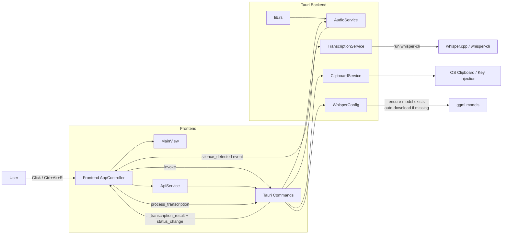
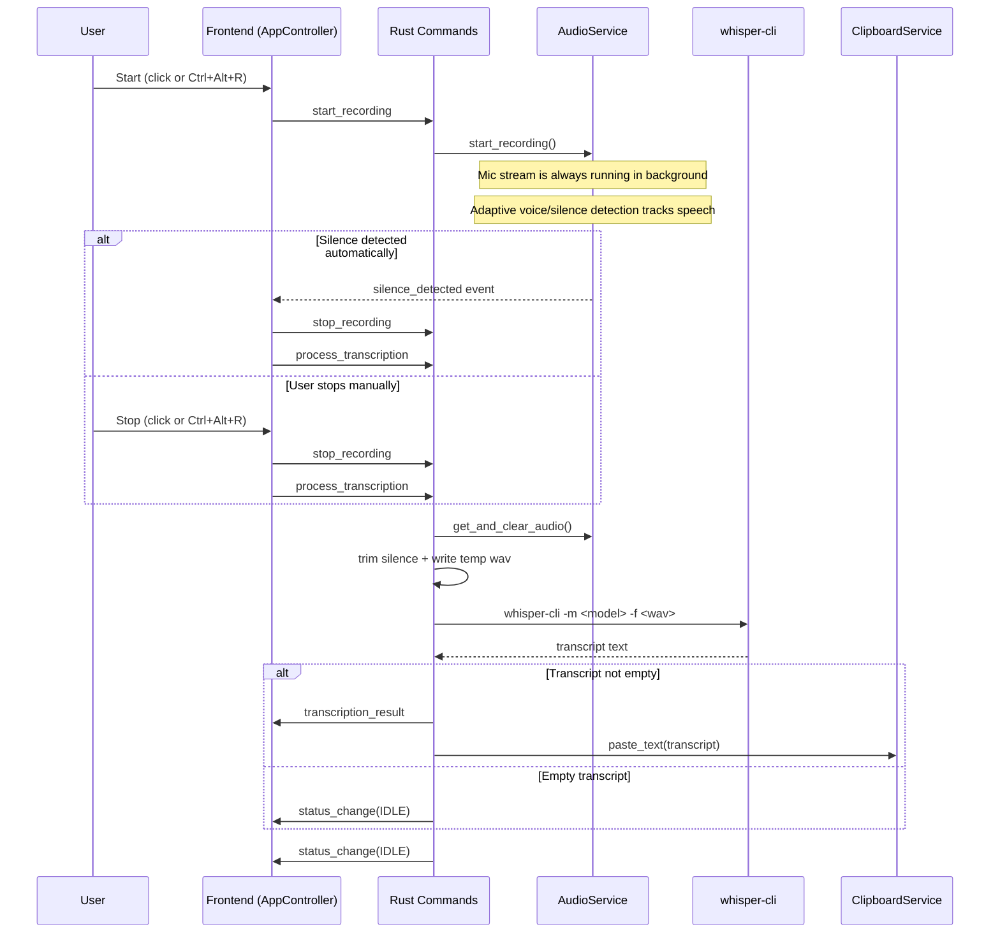

# Audio Paste

Offline voice-to-text desktop app built with **Tauri + Rust + Vanilla TypeScript**.

You press a hotkey (or click), speak, and the app transcribes locally with `whisper.cpp` and pastes the text into the focused app.

## What It Does

- Captures microphone audio at 16kHz
- Detects speech/silence and auto-stops recording
- Runs local transcription using `whisper-cli`
- Copies transcript to clipboard and tries auto-paste (`Ctrl+V` / `Cmd+V`)
- Supports Linux, macOS, and Windows (with OS-specific hotkey/paste paths)

## Tech Stack

- Frontend: Vanilla TypeScript + Vite
- Desktop runtime: Tauri v2
- Backend: Rust
- Speech engine: `whisper.cpp` (`whisper-cli` binary)

## Project Structure

- `src/`: frontend UI/controller/api
- `src-tauri/src/lib.rs`: app startup, event wiring, OS-specific hotkey setup
- `src-tauri/src/controllers/commands.rs`: Tauri commands (`start_recording`, `stop_recording`, `process_transcription`, `apply_config`)
- `src-tauri/src/services/audio_service.rs`: input stream, speech/silence logic, WAV writing
- `src-tauri/src/services/transcription_service.rs`: `whisper-cli` execution + parsing
- `src-tauri/src/services/clipboard_service.rs`: clipboard + paste simulation
- `src-tauri/src/config/whisper_config.rs`: model/binary discovery + model auto-download

## Architecture Diagram



## Complete Runtime Flow



## How Configuration Works

Startup config is loaded from:

1. Hardcoded defaults (`tiny.en`, `cpu`, `4 threads`)
2. `APP_ENV` (`development` / `testing` / `production`)
3. Optional user file: `~/.audio-paste/config.json`

Example user config:

```json
{
  "model_size": "tiny.en",
  "device": "cpu",
  "cpu_threads": 4
}
```

## Setup
 

### Linux (Build)

```bash
npm install
cd src-tauri/whisper.cpp
cmake -S . -B build
cmake --build build --config Release -j"$(nproc)"
cd ../..
npm run build
npx tauri build
```
 

### macOS (Build)

```bash
npm install
cd src-tauri/whisper.cpp
cmake -S . -B build
cmake --build build --config Release -j"$(sysctl -n hw.ncpu)"
cd ../..
npm run build
npx tauri build
```

### Windows (Build) (PowerShell)

```powershell
npm install
cd src-tauri/whisper.cpp
cmake -S . -B build
cmake --build build --config Release
cd ../..
npm run build
npx tauri build
```
 