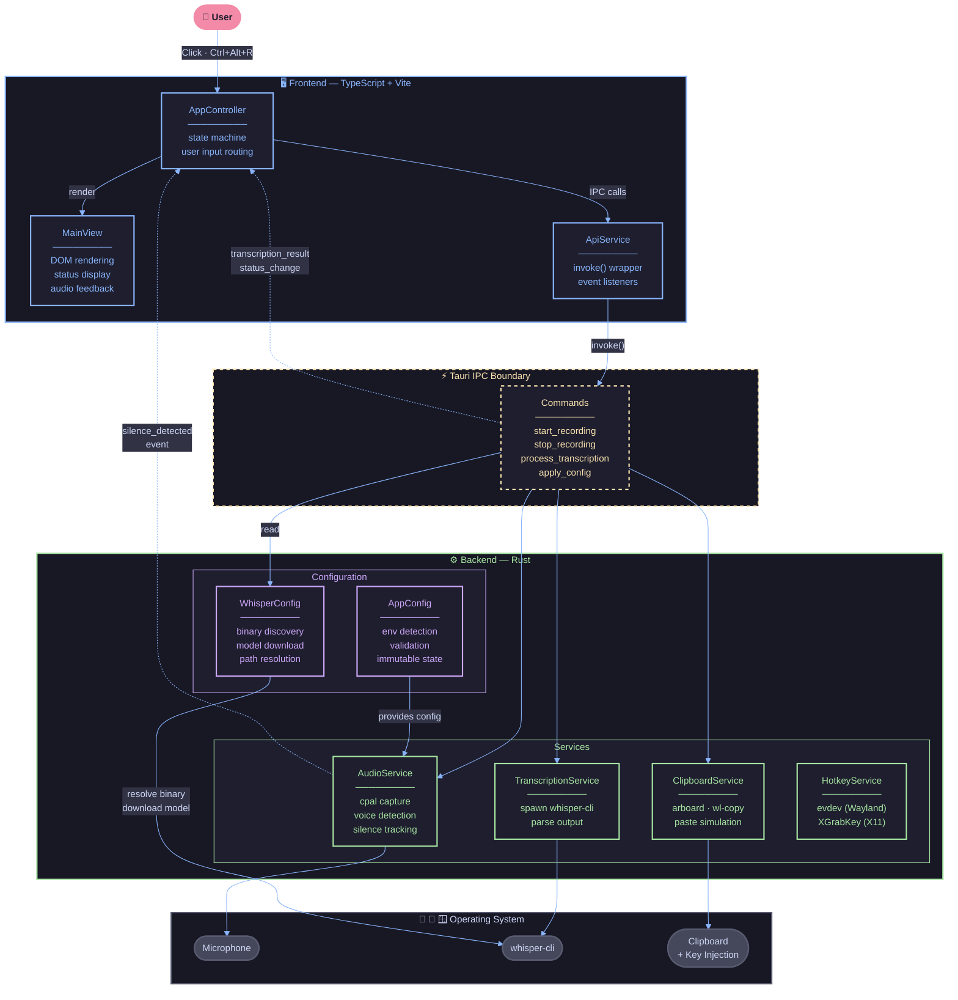

# Audio Paste

Offline voice-to-text desktop app built with **Tauri + Rust + React**.

You press a hotkey (or click), speak, and the app transcribes locally with `whisper.cpp` and pastes the text into the focused app.

## Demo

<video width="600" controls>
  <source src="media.mp4" type="video/mp4">
  Your browser does not support the video tag.
</video>

## What It Does

- Captures microphone audio at 16kHz
- Detects speech/silence and auto-stops recording
- Runs local transcription using `whisper-cli`
- Copies transcript to clipboard and tries auto-paste (`Ctrl+V` / `Cmd+V`)
- Supports Linux, macOS, and Windows (with OS-specific hotkey/paste paths)

## Project Structure

- `src/`: frontend UI/controller/api
- `src-tauri/src/lib.rs`: app startup, event wiring, OS-specific hotkey setup
- `src-tauri/src/controllers/commands.rs`: Tauri commands (`start_recording`, `stop_recording`, `process_transcription`, `apply_config`)
- `src-tauri/src/services/audio_service.rs`: input stream, speech/silence logic, WAV writing
- `src-tauri/src/services/transcription_service.rs`: `whisper-cli` execution + parsing
- `src-tauri/src/services/clipboard_service.rs`: clipboard + paste simulation
- `src-tauri/src/config/whisper_config.rs`: model/binary discovery + model auto-download

## Architecture Diagram

> System-level overview — how the frontend, backend, and OS layers connect.



---

## Complete Runtime Flow

> Step-by-step sequence from startup → record → transcribe → paste.

```mermaid
%%{init: {
  "theme": "base",
  "themeVariables": {
    "primaryColor":       "#1e1e2e",
    "primaryTextColor":   "#cdd6f4",
    "primaryBorderColor": "#585b70",
    "lineColor":          "#89b4fa",
    "actorTextColor":     "#cdd6f4",
    "actorBkg":           "#313244",
    "actorBorder":        "#89b4fa",
    "activationBkgColor": "#313244",
    "activationBorderColor":"#89b4fa",
    "signalColor":        "#89b4fa",
    "noteBkgColor":       "#45475a",
    "noteTextColor":      "#cdd6f4",
    "noteBorderColor":    "#585b70",
    "altSectionBkgColor": "#181825",
    "loopTextColor":      "#f9e2af",
    "labelTextColor":     "#f38ba8",
    "fontSize":           "13px"
  }
}}%%

sequenceDiagram
  autonumber

  actor User as 🎤 User
  participant UI   as 🖥️ AppController
  participant API  as ⬡ ApiService
  participant CMD  as ⚡ Tauri Commands
  participant Audio as 🔊 AudioService
  participant WConf as 📦 WhisperConfig
  participant WCLI  as 🤖 whisper-cli
  participant Clip  as 📋 ClipboardService

  rect rgb(24, 24, 37)
    Note over UI, WConf: 🔧 STARTUP — Configuration & Model Resolution
    UI  ->>+ API  : applyConfig(tiny, cpu, 4, 0.01, 2)
    API ->>+ CMD  : invoke("apply_config", {...})
    CMD ->>+ WConf : WhisperConfig::new()
    WConf ->> WConf : resolve whisper-cli binary
    WConf ->> WConf : stage runtime libs (LD_LIBRARY_PATH)

    alt Model file missing
      WConf ->> WConf : download from huggingface (curl / wget)
    end

    WConf -->>- CMD : WhisperConfig { cli_path, model_path, ... }
    CMD  -->>- API : Ok(())
    API  -->>- UI  : status → IDLE ✅
  end

  rect rgb(24, 24, 37)
    Note over User, Audio: 🎙️ RECORDING — Voice Capture
    User ->>  UI   : Click or Ctrl+Alt+R
    UI   ->>  UI   : playTick() 🔔
    UI   ->>+ API  : startRecording()
    API  ->>+ CMD  : invoke("start_recording")
    CMD  ->>  Audio : start_recording() → set flag
    CMD  -->>- API : Ok(())
    API  -->>- UI  : status → LISTENING 🟢

    Note over Audio: cpal mic stream (mono 16kHz) is always running
    Note over Audio: Adaptive threshold detects voice & tracks silence
  end

  rect rgb(24, 24, 37)
    Note over User, Audio: ⏹️ STOP — Silence or Manual
    alt Silence detected automatically
      Audio -->> UI : emit("silence_detected") 🔇
    else User stops manually
      User  ->>  UI : Click or Ctrl+Alt+R
    end

    UI   ->>+ API  : stopRecording()
    API  ->>+ CMD  : invoke("stop_recording")
    CMD  ->>  Audio : stop_recording() → clear flag
    CMD  -->>- API : Ok(())
    API  -->>- UI  : status → TRANSCRIBING ⏳
  end

  rect rgb(24, 24, 37)
    Note over UI, Clip: 🧠 TRANSCRIPTION — Whisper Processing
    UI   ->>+ API  : processTranscription()
    API  ->>+ CMD  : invoke("process_transcription")
    CMD  ->>  Audio : take_audio_buffer() (Mutex + mem::take)
    CMD  ->>  CMD  : trim leading/trailing silence
    CMD  ->>  CMD  : write temp WAV (/tmp/audio-paste-*.wav)

    CMD  ->>+ WCLI : spawn whisper-cli -m <model> -f <wav>
    WCLI -->>- CMD : raw stdout

    CMD  ->>  CMD  : parse & clean transcript text

    alt Transcript is non-empty
      CMD  -->> UI  : emit("transcription_result", text) 📝
      CMD  ->>+ Clip : paste_text(text)
      Clip ->>  Clip : set clipboard (arboard / wl-copy)
      Clip ->>  Clip : simulate Ctrl+V / Cmd+V
      Clip -->>- CMD : done
    else Transcript is empty
      CMD  -->> UI  : emit("status_change", "IDLE") 💤
    end

    CMD  ->>  CMD  : remove temp WAV 🗑️
    CMD  -->>- API : Ok("")
    API  -->>- UI  : status → IDLE 🟢
  end
```



---

## Setup

### Linux (Build)

```bash
npm install
cd src-tauri/whisper.cpp
cmake -S . -B build
cmake --build build --config Release -j"$(nproc)"
cd ../..
npm run build
npx tauri build
```

### macOS (Build)

```bash
npm install
cd src-tauri/whisper.cpp
cmake -S . -B build
cmake --build build --config Release -j"$(sysctl -n hw.ncpu)"
cd ../..
npm run build
npx tauri build
```

### Windows (Build) (PowerShell)

```powershell
npm install
cd src-tauri/whisper.cpp
cmake -S . -B build
cmake --build build --config Release
cd ../..
npm run build
npx tauri build
```
